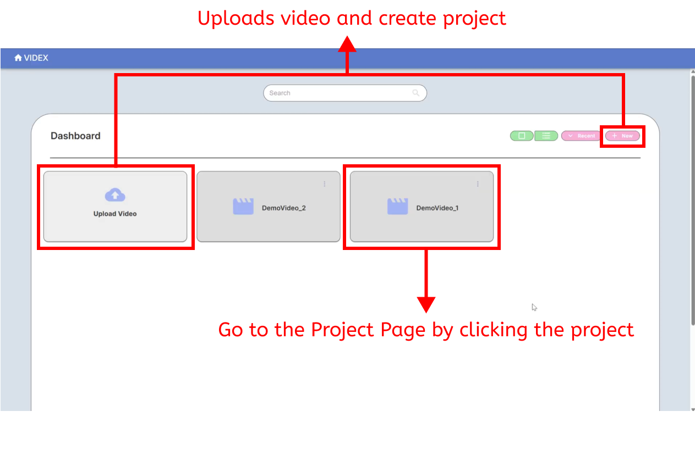
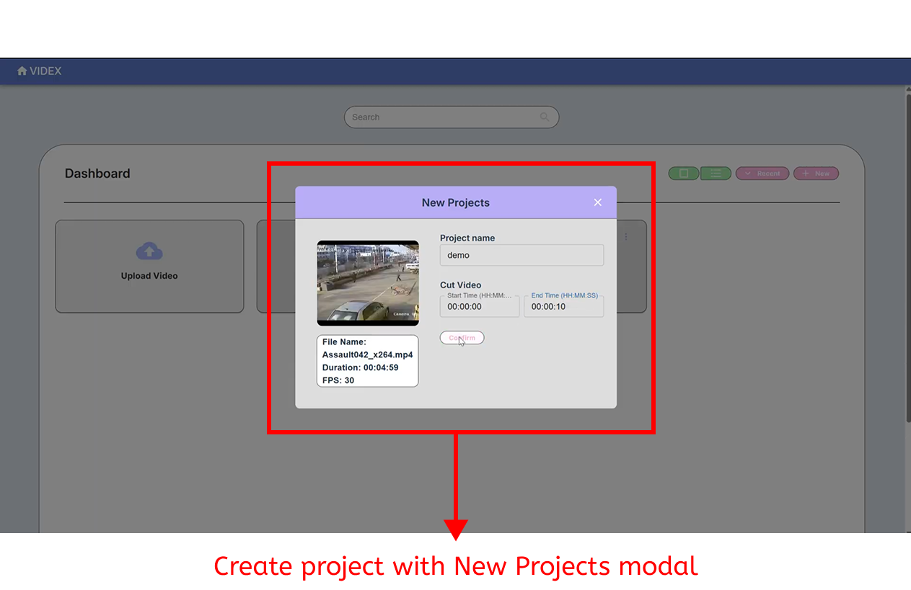
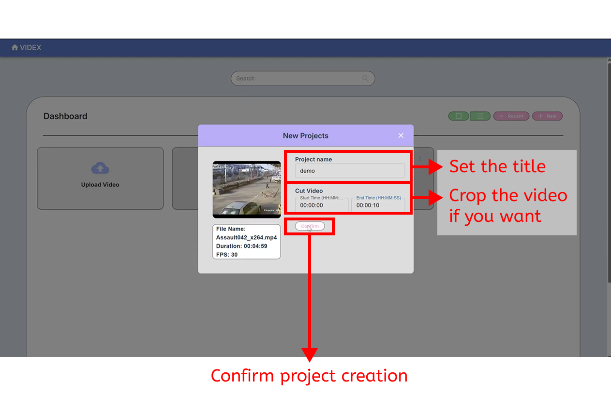
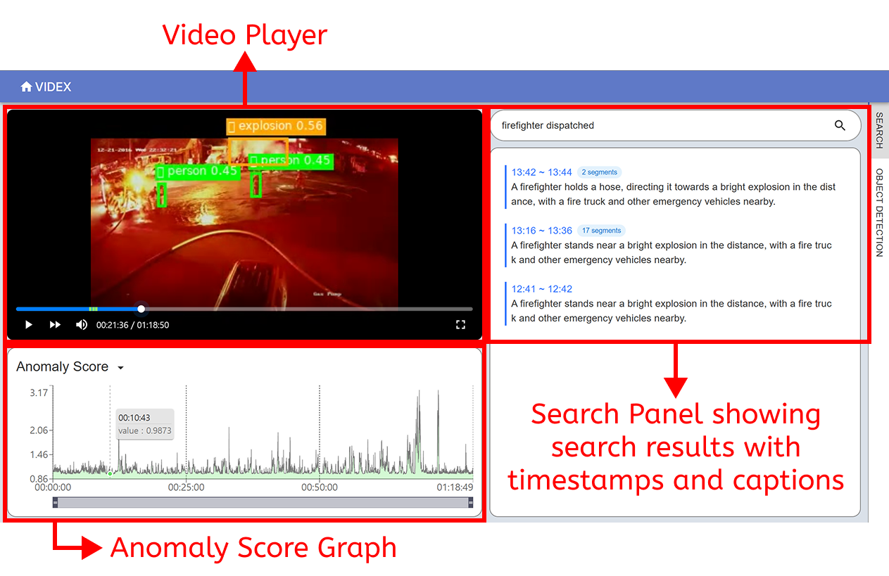
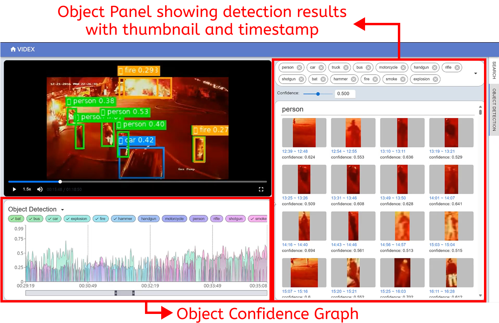

# VIDEX


<br/>


<br/>

**VIDEX** is a **semantic video indexing** system that converts **surveillance footage** into searchable segments through integrated **object detection**, **open-vocabulary expansion**, and **retrieval-enhanced scene captioning**. The system enables **rapid natural-language retrieval** of incident-relevant scenes and **reduces analytical workload** through **scalable distributed inference**.<br/><br/>

VIDEX is developed by HAIL Lab in Handong Global University. <br/><br/>

## Key word

- Semantic video indexing
- Natural-language video retrieval
- Surveillance video
- Open-vocabulary detection<br/><br/><br/>


# Demo Video

Demo video is avaiable in [YouTube](https://youtu.be/5DjljvfGSZQ)
<br/>

[](https://youtu.be/5DjljvfGSZQ)

<br/><br/>

# Interface

The frontend of VIDEX offers user-friendly interface so that user can easily explore the result of analysis. Here are more detailed descroption about interface and how to use them.<br/><br/>
  
  
## Home Page



- Create new project by **Upload video buttom** or **New buttom**
- Go to **Project Page** by clicking a project <br/><br/>



- Uploads video in **New Projects modal** <br/><br/>




- Set project name and crop the video
- Confirm create new project <br/><br/>
  
  
## Project Page



- **Video Player**
    - Video with Yolo&OWL-ViT Object Detection Bounding Box
    - Play/Pause, Fast Forward, Volume Control, Full Screen
- **Anomaly Score Graph**
    - Show **LOF score** computed by video segment embedding
- **Search Panel**
    - Submit user query through Search Bar
    - Retrieve the top-20 description and correcponding timestamp
    - Combine consequtive similar description<br/><br/>
  
  


- **Object Confidence Graph**
    - Show multiple confidences of detected objects
    - User can toggle each object class graph
- **Object Detection Panel**
    - Show the result of object detection with thumbnail and correcponding timestamp
    - Filter the result by toggling chips or select and setting confidence threshold<br/><br/>
  
# Quick Start 

## 1. Prerequisites

To run VIDEX, you need:

-   Docker
-   Docker Compose (included in Docker Desktop on some systems)
-   NVIDIA GPU + NVIDIA Driver + NVIDIA Container Toolkit
-   [Milvus DB Settings](https://milvus.io/docs/overview.md)

## 2. Clone the repository

```bash
git clone https://github.com/nth221/videx-d
cd videx-d
```

## 3. Configure environment

open docker-compose.yml file, change <SERVER_IP> to your server ip

## 4. Pull images and build services

```bash
# Pull the latest core image from Docker Hub
docker compose pull

# Build frontend and start all services
docker compose up -d --build
```

## 5. Check container status

```
docker ps
```

You should see the following containers in Up state:

-   videx-frontend
-   videx-backend
-   videx-yolo-api
-   videx-vivit-api
-   videx-vlm-api
-   videx-tte-api

## 6. Access the web interface

```
http://<SERVER_IP>:5173
```

## 7. Stopping and restarting the stack

To stop all services:

```bash
docker compose down
```

To restart after code or configuration changes:

```bash
docker compose pull             # if the core image was updated
docker compose up -d --build
```
