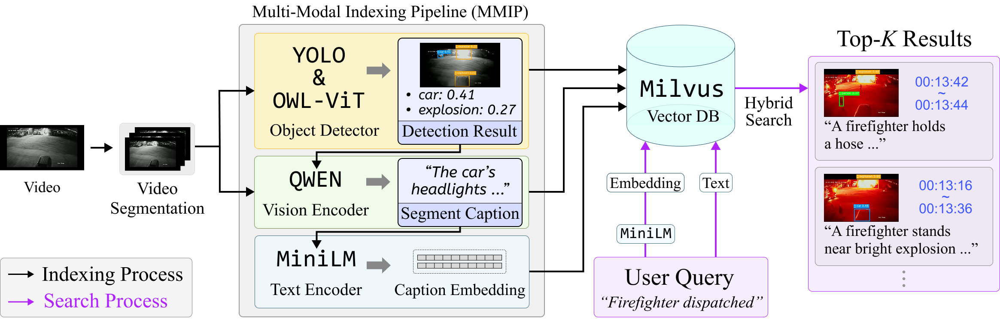

# VIDEX


<br/>

**VIDEX** is a **semantic video indexing** system that converts **surveillance footage** into searchable segments through integrated **object detection**, **open-vocabulary expansion**, and **retrieval-enhanced scene captioning**. The system enables **rapid natural-language retrieval** of incident-relevant scenes and **reduces analytical workload** through **scalable distributed inference**.<br/><br/>

## Key word

- Semantic video indexing
- Natural-language video retrieval
- Surveillance video
- Open-vocabulary detection<br/><br/><br/>


# Demo Video

Demo video is avaiable in [YouTube](https://youtu.be/5DjljvfGSZQ)
<br/><br/>

# System Architecture and Implementation



<br/>

VIDEX is structured as a modular system composed of a user interface, backend controller, distributed inference servers, and a vector database. Its frontend enables users to upload surveillance footage and inspect analysis results, while the backend coordinates all processing through asynchronous execution. Distributed servers handle object detection, caption generation, and embedding extraction, and their outputs are unified within the Multi-Modal Indexing Pipeline (MMIP), which constructs the system's semantic index. Multiple MMIP instances can be deployed in parallel, allowing the indexing throughput to scale horizontally with available compute resources. A Milvus vector database stores segment-level embeddings and supports low-latency semantic similarity search across large video collections.

<br/><br/>

# Interface

The frontend of VIDEX offers user-friendly interface so that user can easily explore the result of analysis. Here are more detailed descroption about interface and how to use them.<br/><br/>
  
  
## Home Page


- Create new project by **Upload video buttom** or **New buttom**
- Go to **Project Page** by clicking a project <br/><br/>


- Uploads video in **New Projects modal** <br/><br/>


- Set project name and crop the video
- Confirm create new project <br/><br/>
  
  
## Project Page


- **Video Player**
    - Video with Yolo&OWL-ViT Object Detection Bounding Box
    - Play/Pause, Fast Forward, Volume Control, Full Screen
- **Anomaly Score Graph**
    - Show **LOF score** computed by video segment embedding
- **Search Panel**
    - Submit user query through Search Bar
    - Retrieve the top-20 description and correcponding timestamp
    - Combine consequtive similar description<br/><br/>
  
  


- **Object Confidence Graph**
    - Show multiple confidences of detected objects
    - User can toggle each object class graph
- **Object Detection Panel**
    - Show the result of object detection with thumbnail and correcponding timestamp
    - Filter the result by toggling chips or select and setting confidence threshold

<br/><br/>
  
# Quick Start 

## 1. Prerequisites

To run VIDEX, you need:

-   Docker
-   Docker Compose (included in Docker Desktop on some systems)
-   NVIDIA GPU + NVIDIA Driver + NVIDIA Container Toolkit
-   [Milvus DB Settings](https://milvus.io/docs/overview.md)

## 2. Clone the repository

```bash
git clone https://github.com/nth221/videx-d
cd videx-d
```

## 3. Configure environment

open docker-compose.yml file, change <SERVER_IP> to your server ip

## 4. Pull images and build services

```bash
# Pull the latest core image from Docker Hub
docker compose pull

# Build frontend and start all services
docker compose up -d --build
```

## 5. Check container status

```
docker ps
```

You should see the following containers in Up state:

-   videx-frontend
-   videx-backend
-   videx-yolo-api
-   videx-vivit-api
-   videx-vlm-api
-   videx-tte-api

## 6. Access the web interface

```
http://<SERVER_IP>:5173
```

## 7. Stopping and restarting the stack

To stop all services:

```bash
docker compose down
```

To restart after code or configuration changes:

```bash
docker compose pull             # if the core image was updated
docker compose up -d --build
```
